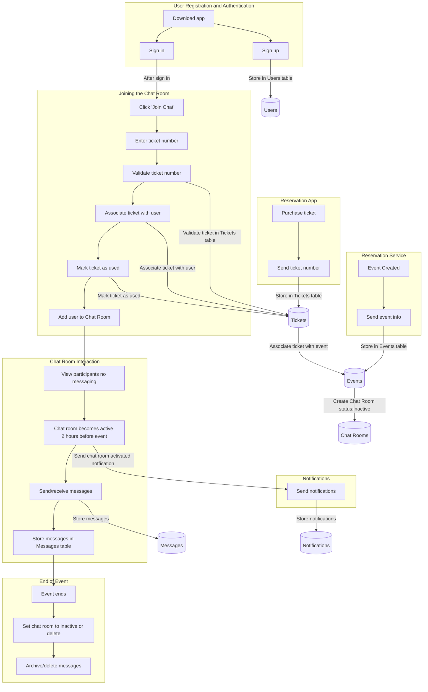
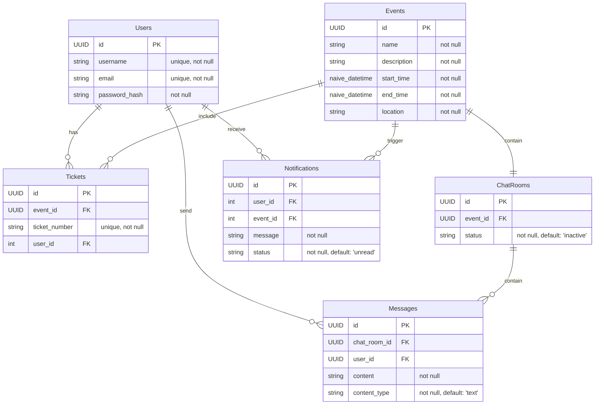

# Ticket Reservation Messaging Service

## Table of Contents

1.  [Flow Chart](#flow-chart)
2.  [Database Design](#database-design)
3.  [Endpoints](#endpoints)
    - [Events](#events)
        -   [Create Event](#create-event)
        -   [Update Event](#update-event)
        -   [Delete Event](#delete-event)
        -   [Get Event's Chat Room](#get-events-chat-room)
	- [Users](#users)
        -   [Sign Up](#sign-up)
        -   [Sign In](#sign-in)
        -   [Sign Out](#sign-out)
        -   [Show User](#show-user)
        -   [Update User](#update-user)
        -   [Delete User](#delete-user)
	- [Tickets](#tickets)
	    - [Create Ticket](#create-ticket)
   		- [Assign Ticket](#assign-ticket)
    - [Chat Room](#chat-room)

# Flow Chart



# Database design 


# Endpoints

### Events
---

#### Create Event

Creates an event along with its associated chat room.

`POST api/events/create_event`
    
   **Parameters**:
    
   -   `name` (string): The name of the event.
   -   `description` (string): A brief description of the event.
   -   `location` (string): The location where the event will take place.
   -   `start_time` (string): The start time of the event in the format "YYYY-MM-DD HH:MM :SS"
   -   `end_time` (string): The end time of the event in the format "YYYY-MM-DD HH:MM:SS ".
    
**Example Usage**:
    
 `Request Body`:
  
```json{
      {"event": {
        "name": "concert",
        "description": "A great music concert",
        "location": "Antalya",
        "start_time": "2025-01-01 19:00:07",
        "end_time": "2025-01-01 23:00:07"
	      }
	   }
```
 `Response`:
    
  - `201 Created`: The event was successfully created and returned in the response body.
  - `422 Unprocessable Entity`: The request body contains invalid data.

---  
#### Update Event
 Updates an event with the given parameters.
 
 `POST api/events/update_event`

**Parameters**:
  - `id` (string): The ID of the event to be updated.
  - `event` (map): A map containing the event parameters to be updated.

**Event Parameters**:
  - `name` (string, optional): The updated name of the event.
  - `description` (string, optional): The updated description of the event.
  - `location` (string, optional): The updated location of the event.
  - `start_time` (string, optional): The updated start time of the event in the format "YYYY-MM-DD HH:MM:SS".
  - `end_time` (string, optional): The updated end time of the event in the format "YYYY-MM-DD HH:MM:SS".

**Example Usage**:

`Request Body`:
  ```json
  {
    "id": "44d2557e-ec2b-4dc5-a0cc-f8b5cb83bc6f",
    "event": {
      "name": "Updated Concert",
      "description": "An updated great music concert",
      "location": "Updated Antalya",
      "start_time": "2025-01-01 20:00:00",
      "end_time": "2025-01-01 23:30:00"
    }
  }
```

`Response`:
 - `200 OK`: The event was successfully updated and returned in the response body.
 - `404 Not Found`: The event with the given ID was not found.
 - `422 Unprocessable Entity`: The request body contains invalid data.

---
#### Delete Event
 Deletes an event based on the given event ID.

 `DELETE /api/events/:id`

**Parameters**: 
  - `event_id`: The ID of the event to be deleted.

**Example Usage**:
 `DELETE /api/events/44d2557e-ec2b-4dc5-a0cc-f8b5cb83bc6f`
      
`Response`:
 - `204 No Content`: The event was successfully deleted.
 - `404 Not Found`: No event found with the given ID.
 - `500 Internal Server Error`: Server error during event deletion


---
#### Get Event's Chat Room

 Retrieves the chat room associated with the given event ID.
 
`POST api/events/get_chat_room_by_id`

**Parameters:**

  - `event_id` (string): The ID of the event.

**Example Usage:**

  `Request Body`:
```json
  {
    "event_id": "44d2557e-ec2b-4dc5-a0cc-f8b5cb83bc6f"
  }
```

  `Response`:
  - `200 OK`: The chat room ID and status are returned.
  - `404 Not Found`: No chat room found for the given event ID.

### Users
---
#### Sign Up
	Creates a new user and returns a token upon successful creation.

  `POST api/users/create`

  **Parameters**: 

  - `user_params` (map):

  **Example Usage**:

  ```json
  {
    "user_params": {
    "username": "sample_user", 
    "email": "sample@email.com" , 
    "password_hash": "hashed+password"
    }
  }
  ```
 
  `Response`:
  - `201 Created`: Returns the created user and an authentication token.

---
#### Sign In
  Authenticates a user and returns a token upon successful sign-in.

  `POST api/users/sign_in`

  **Parameters**:
  email (string): The user's email.
  password_hash (string): The user's password hash.

  **Example Usage**:

  ```json
  {
    "email": "sample@email.com", 
    "password_hash": "hashed+password"
  }
  ```
  `Response`: 
  - `200 OK`: Returns the authenticated user and a token.
  - `401 Unauthorized`: Raises an error if the email or password is incorrect.
---
#### Show User
  Retrieves and displays user details by ID.  

  `GET api/users/:id`

  **Parameters**:
  - `id`: The user's ID.

  **Example Usage**:
  `GET /api/users/44d2557e-ehb0-a45e-a0cc-f8b5cb83bc6f`

  `Responses`:
  - `200 OK`:Returns the user details.  
  - `401 Unauthorized`: Raises an error if token invalid.
  - `403 Forbidden`: Raises an an error if session id and id paramater don't match 
---
#### Update User
  Updates an existing user's information.

  `POST api/users/update`

  **Parameters**:
  - `id` (string): The user's ID.
  - `user_params` (map): A map containing the updated user parameters.
 
  **Example Usage**:

  ```json
  { 
    "id": "44d2557e-ehb0-a45e-a0cc-f8b5cb83bc6f",
    "user_params":
      {
      "email": "updated@email.com", 
      "password_hash": "updated+hashed+password"
      }
  }
  ```
  `Response`:
  - `200 OK`: Returns the updated user details.
  - `401 Unauthorized`: Raises an error if token invalid.
  - `403 Forbidden`: Raises an an error if session id and id paramater don't match
---
#### Delete User

  Deletes a user by ID.

  `DELETE api/users/delete_user/:id`

  **Parameters**:
  - `id`: The user's ID.

  **Example Usage**:
  `DELETE /api/users/delete/44d2557e-ehb0-a45e-a0cc-f8b5cb83bc6f`
  
  `Response`:
  - `204 No Content`: Confirms the user has been deleted.
  - `401 Unauthorized`: Raises an error if token invalid.
  - `403 Forbidden`: Raises an an error if session id and id paramater don't match
    
### Tickets
---
#### Create Ticket
  Creates a new ticket.

  `POST /api/tickets/create`

  **Parameters**:

  - `ticket_params` (map): A map containing the ticket details.

  **Example Usage**:

  ```json
  {
    "ticket": {
      "ticket_number": "123456789",
      "event_id": "44d2557e-ehb0-a45e-a0cc-f8b5cb83bc6f"
    }
  }
```

  `Response`:
  - `201 Created`: Returns the created ticket.
---
#### Assign Ticket
  Assigns a ticket to a user.

  `PATCH /api/tickets/:ticket_id/assign/:user_id`

  **Parameters**:

  `ticket_id` (string): The ID of the ticket to be assigned.
  `user_id` (string): The ID of the user to whom the ticket will be assigned.
  
  **Example Usage**:
	`PATCH /api/tickets/44d2557e-ehb0-a45e-a0cc-f8b5cb83bc6f/assign/78f9b11e-bc90-45e2-9f7f-5d4df4c7e5bb`
 

  `Response`:
  - `200 OK`: Returns the updated ticket with the assigned user.
  - `404 Not Found`: Returns an error if the ticket does not exist.

### Chat Room
---
#### 1. **Establish WebSocket Connection**

**Endpoint:** `ws://localhost:4000/socket`

**Parameters:**
- `token`: The JWT token for authentication.

```javascript
import { Socket } from "phoenix";

let socket = new Socket("ws://localhost:4000/socket", { params: { token: "<JWT_TOKEN>" } });

socket.connect();
```

**Description:**  
This code initiates a WebSocket connection to the Phoenix server using a JWT token for authentication.

---

#### 2. **Join Channel**

**Channel Name:** `event: event_id`

**Example Usage:**

```javascript
let channel = socket.channel("event:44d2557e-ec2b-4dc5-a0cc-f8b5cb83bc6f", {});

channel.join()
  .receive("ok", resp => { console.log("Joined successfully", resp); })
  .receive("error", resp => { console.log("Unable to join", resp); });
```

**Description:**  
Joins a specific channel based on the event ID. The `receive` function handles the success or error response from the server.

---

#### 3. **Send Message**

**Function:** `sendMessage(content)`

**Method:** `channel.push`

**Parameters:**
- `content` (string): The message content to be sent.

**Example Usage:**

```javascript
sendMessage("Hello, World!")
  .then(resp => console.log("Message sent", resp))
  .catch(err => console.error("Message failed", err));
```

**Description:**  
Sends a new message to the channel. Returns a promise that resolves when the message is sent successfully or rejects if there is an error.

---

#### 4. **Notify Typing Status**

**Function:** `sendTyping(typing)`

**Method:** `channel.push`

**Parameters:**
- `typing` (boolean): The typing status (`true` if typing, `false` if not).

**Example Usage:**

```javascript
sendTyping(true);
```

**Description:**  
Notifies the server that the user is typing. This is useful for real-time feedback to other users.

---

#### 5. **Handle Incoming Messages**

**Function:** `onMessageReceived(callback)`

**Method:** `channel.on`

**Parameters:**
- `callback` (function): A callback function to handle incoming messages.

**Example Usage:**

```javascript
onMessageReceived((message) => {
  console.log("New message received", message);
});
```

**Description:**  
Listens for incoming messages on the channel and triggers the provided callback function when a new message is received.

---

#### 6. **Handle Typing Notifications**

**Function:** `onUserTyping(callback)`

**Method:** `channel.on`

**Parameters:**
- `callback` (function): A callback function to handle typing notifications.

**Example Usage:**

```javascript
onUserTyping((typingStatus) => {
  console.log("User typing status", typingStatus);
});
```

**Description:**  
Listens for typing status updates on the channel and triggers the provided callback function when a typing status is received.
